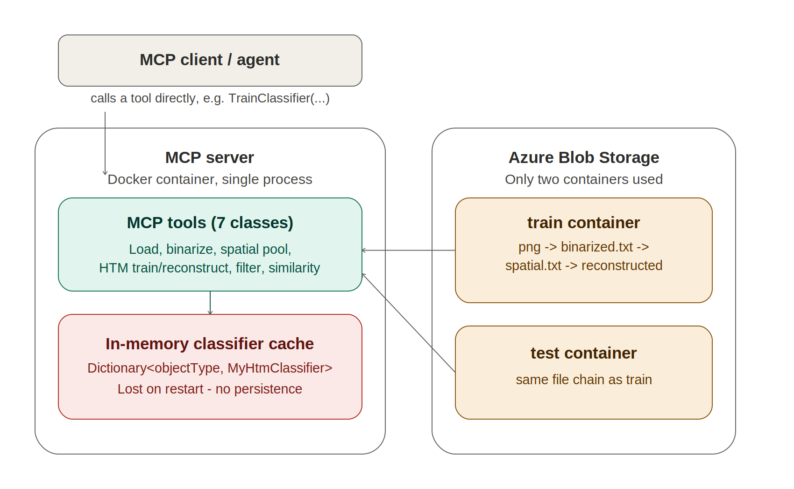

# ML 24/25-01 Investigate Image Reconstruction By Using Classifier

## Abstract

Efficient image storage and reconstruction are critical in the era of increasing digital content. Traditional image storage methods require significant memory, making retrieval costly and inefficient. This paper presents a novel image reconstruction framework that compresses images into Sparse Distributed Representations (SDRs) using a biologically inspired approach based on Hierarchical Temporal Memory (HTM).
The system employs K-Nearest Neighbors (KNN) and HTM-based classifiers to reconstruct images with high accuracy while significantly reducing storage requirements. The framework is trained on 10,000 images and tested on 2,000 images, achieving robust reconstruction with minimal data loss. Leveraging the NeoCortex API for SDR generation, this methodology optimizes storage efficiency without compromising image fidelity.
The proposed approach has the potential to revolutionize cloud storage, AI-powered image enhancement, and digital content management by offering an ultra-efficient yet accurate image compression and retrieval system.

---

## Link to  Project  [Link](https://github.com/Eyad-Elsheita/Code_Avengers/tree/development/Image_Reconstruction_Classifier)
## Link to  Documentation [Link](https://github.com/Eyad-Elsheita/Code_Avengers/tree/development/Image_Reconstruction_Classifier/Documentation)
## Link to  UnitTesting [Link](https://github.com/Eyad-Elsheita/Code_Avengers/tree/development/Image_Reconstruction_Classifier/UnitTests)

## Overview

This project introduces a multi-step framework designed to address the challenge of storing and reconstructing high-fidelity images with reduced memory overhead. The main components of the framework are as follows:

- **Image Preprocessing:**  
  Raw images are initially preprocessed. This includes converting images to a binarized format and vectorizing them into 1D arrays, thereby simplifying the data for subsequent processing steps.

- **Feature Extraction:**  
  A custom spatial pooling algorithm, encapsulated in the ImageSpatial class, converts these preprocessed images into Sparse Distributed Representations (SDRs). SDRs are compact, noise-resistant encodings that capture the essential spatial features of the image.

- **Classifier Training:**  
  Two types of classifiers are employed: an HTM-based classifier that leverages biologically inspired learning and a KNN classifier that identifies similar patterns based on a distance metric. Both classifiers are trained on a dataset of 10,000 images.

- **Image Reconstruction:**  
  During testing, images are reconstructed by fusing predictions from the HTM and KNN classifiers. This fusion strategy is designed to balance the strengths of each classifier, resulting in more accurate image reconstruction.

- **Evaluation:**  
  The framework quantitatively compares the reconstructed images against the original test images using vector (cosine similarity) and binary similarity metrics to ensure the fidelity of reconstruction.

---

## Getting Started

### Prerequisites

To set up and run the project, ensure you have:

- **Microsoft Visual Studio**
- **.NET 9.0 Target Framework**

Required Libraries:

- ClosedXML: For handling Excel output to record test and evaluation metrics.
- HtmImageEncoder: For SDR generation and handling HTM operations.
- LearningApi: For implementing the learning algorithm behind the HTM classifier.
- NeoCortexApi: To integrate NeoCortex’s biological model for SDRs.
- ImageBinarizer: For converting images into binarized formats.
- SkiaSharp: For robust image processing and manipulation.
- SixLabors.ImageSharp: For additional image handling capabilities.
- ModelContextProtocol (MCP SDK): Exposes each pipeline stage as an MCP tool, callable over STDIO or HTTP.
- Azure.Storage.Blobs: For reading/writing images and intermediate files to the `train`/`test` blob containers.

### Running the Project

1. **Open the Project:**  
   Open the solution in Visual Studio.

2. **Build and Run:**  
   Set the startup project (typically `Program.cs`) and run the project.

3. **Command Line Option:**  
   Alternatively, run the project from the command line:
   
   ```bash
   dotnet run --project "Path/To/Your/Project/YourProject.csproj"
   ```

4. **Run as an MCP Server:**  
   The project also runs as an MCP server exposing each pipeline stage (load, binarize, spatial pool, train/reconstruct, filter, similarity) as a callable tool over STDIO or HTTP. An MCP client can then trigger a stage directly, e.g. `TrainClassifier(containerName: "train", objectType: "3")`.

5. **Run via Docker / Azure:**  
   A `Dockerfile` builds the server on `.NET 9.0` (multi-stage: `dotnet/sdk:9.0` → `dotnet/runtime:9.0`). The image is pushed to Azure Container Registry and deployed to Azure App Service, where it's reachable by an MCP client. See **Figure 2b** below for the full runtime architecture.

---

## Problem Statement

The exponential growth in image data has created a demand for efficient storage and reconstruction methods that overcome the limitations of traditional approaches. Standard image formats like JPEG or PNG often involve a trade-off between compression rate and image quality, leading to either excessive storage needs or unacceptable degradation in image fidelity. This project tackles the following challenges:

- **Memory Overhead:**  
  High-resolution images demand substantial storage space, making it impractical to archive and retrieve them efficiently.
- **Reconstruction Accuracy:**  
  There is often a loss in image quality when compressing and decompressing images using traditional methods.
- **Computational Efficiency:**  
  Existing techniques may require extensive computation to reconstruct images, limiting real-time applications.


To address these challenges, our framework compresses images into SDRs using a biologically inspired spatial pooling mechanism and reconstructs them using a hybrid classifier approach that combines the robustness of HTM with the precision of KNN. The output is an image reconstruction process that minimizes data loss while significantly reducing storage requirements.

---

## Introduction

## **Introduction: The Need for Efficient Image Reconstruction**  

In today’s digital era, the rapid expansion of image-based content necessitates more efficient storage, retrieval, and reconstruction techniques. The exponential growth in image data, fueled by advancements in artificial intelligence, social media, and digital archiving, presents significant challenges in terms of storage costs, retrieval speeds, and computational efficiency. Traditional image compression methods, such as JPEG and PNG, often suffer from quality degradation, large storage footprints, or inefficient retrieval mechanisms.

This project introduces a novel hybrid image reconstruction framework that addresses these challenges by utilizing biologically inspired Sparse Distributed Representations (SDRs) and a classifier-based reconstruction approach. The framework leverages Hierarchical Temporal Memory (HTM) for robust feature extraction and K-Nearest Neighbors (KNN) for pixel-level accuracy, effectively balancing efficiency and quality in image storage and reconstruction.

---
## **Key Contributions of This Framework**  

### **1. Significant Reduction in Storage Requirements**  
Traditional image formats store images in high-resolution formats, which require significant memory and computational power to process. By transforming images into SDRs, the framework drastically reduces the amount of stored data while preserving essential visual features. SDRs effectively eliminate redundancy by encoding only the critical components of an image, thus improving both storage efficiency and retrieval speed.

### **2. High-Fidelity Image Reconstruction**  
Conventional compression techniques often lead to visible artifacts and loss of detail. Our dual-classifier approach ensures high reconstruction fidelity through:

- **HTM Classifier:** Extracts meaningful patterns from images by analyzing their sparse representation, making it robust against noise and distortions.  
- **KNN Classifier:** Preserves fine-grained details by leveraging training image sets and identifying the closest match based on similarity metrics.  

### **3. Optimized Reconstruction Through Fusion Techniques**  
By combining outputs from both HTM and KNN classifiers, the system enhances reconstruction accuracy. A **fusion strategy** is employed to intelligently merge predictions from both classifiers using **confidence weighting and Gaussian local voting**. This results in a more **precise and high-quality image reconstruction** while minimizing the drawbacks of individual classifiers.  

### **4. Scalability and Real-World Applications**  
The framework is designed to be scalable, allowing for easy adaptation to large datasets and real-time applications. It can be integrated into various domains, including:  
- **Cloud Storage Optimization:** Reducing bandwidth and storage costs for cloud-based image hosting platforms.  
- **AI-Powered Image Enhancement:** Assisting AI-based upscaling and restoration techniques.  
- **Medical and Satellite Imaging:** Improving the efficiency of image retrieval in healthcare diagnostics and remote sensing applications.  
- **Content Management Systems:** Enabling fast and efficient search and retrieval of compressed image data.  

---

## Project Archeticture overview 

- Training pipeline

**Figure 1:** Training Pipleline
- Test pipeline

**Figure 2:** Test Pipleline

### System / Runtime Architecture

The two flowcharts above describe the data-processing pipeline (how an image moves from raw input to reconstructed output). The diagram below describes the *runtime* architecture — how that pipeline is actually deployed and triggered on Azure.


**Figure 2b:** System architecture — an MCP client triggers a specific pipeline stage directly via an MCP tool call (STDIO or HTTP transport), the tool itself reads/writes Azure Blob Storage (`train` and `test` containers only), and trained HTM classifiers are held in an in-memory dictionary for the lifetime of the server process.

**Note on deployment:** No Azure Queue Storage or Table Storage is used. Triggering is a direct, synchronous MCP tool call rather than a queue-based message, and there is currently no persisted store for trained classifier state — a server restart requires retraining. The server is packaged via Docker (multi-stage build on `.NET 9.0`), pushed to Azure Container Registry, and deployed to Azure App Service, where it is reachable by an MCP client.

## Image Preprocessing and Feature Extraction

### Preprocessing

Efficient image preprocessing is essential for reducing computational complexity while preserving crucial visual information. This stage involves two primary processes:

#### Binarization:

Original images are converted into binary text files using a custom `ImageProcessor`class that transforms pixel values into binary code. This binary representation simplifies the data, making it easier to manage and process in subsequent steps.

```csharp
// Convert images to binary text files
ImageProcessor.ConvertImagesToBinary("Training_Image_Sample", "Training_Image_Binary");
Console.WriteLine("Image binarization completed.");
```
Explanation:
Binarization reduces each pixel to a simple on/off state, which is ideal for storage and later vectorization. This simplification is crucial for generating robust SDRs.

#### Vectorization:

The binarized images are read and flattened into 1D arrays via the `ImageLoader` class Vectorization ensures that the image data is in a format that can be efficiently processed by machine learning algorithms.

```csharp
int[] vectorized = ImageLoader.LoadImage(file);
ImageLoader.SaveImageDataToFile(vectorized, Path.Combine(trainingLoaderFolder, vectorizedFileName));
```
Explanation:
Flattening the image data into a vector allows for easier manipulation during the training phase and subsequent reconstruction. This step is essential for feeding consistent input to both the HTM and KNN classifiers.

### Feature Extraction

#### Spatial Pooler:

The spatial pooling algorithm (implemented in the `ImageSpatial` class)  implements a spatial pooling algorithm to convert binarized images into SDRs. This process highlights the most important spatial features while minimizing noise, thereby creating a compact representation of the original image.

```csharp
// Process images through Spatial Pooler
ImageSpatial.SaveImagesinSpartialPooler();
Console.WriteLine("Spatial Pooler processing completed.");
```
Explanation:
Spatial pooling compresses the image data by identifying and retaining only the significant patterns. This conversion to SDRs is what makes the later stages of classifier training both efficient and accurate.'

---

## Classifier Training and Reconstruction

### Classifier Training

Training involves teaching both classifiers to recognize patterns in the SDRs corresponding to each image type (0–9). This dual-classifier approach ensures that the system can handle both high-level pattern recognition and detailed pixel-level matching.

#### HTM Classifier:

The `MyHtmClassifier` learns by storing both the SDR and the original image vector. This learning process enables it to reconstruct images by applying weighted combinations of training examples based on similarity.

```csharp
htmClassifierForType.Learn(idx, sdr, imageData[idx]);
```
Explanation:
By learning the mapping between SDRs and the original image vectors, the HTM classifier becomes adept at recognizing underlying patterns and structures. This ability is critical when reconstructing images, as it allows for robust performance even in the presence of noise or incomplete data.

#### KNN Classifier:

The `KnnClassifier` complements the HTM classifier by storing the SDRs alongside their labels. When a new image is to be classified, the KNN classifier finds the closest match in its training data using a similarity measure.

```csharp
int predictedLabel = knnClassifierForType.Classify(testSdr, 5);
```
Explanation:
KNN’s approach ensures that even subtle variations in image data are captured. Its strength lies in preserving fine-grained details, making it a valuable component in reconstructing high-quality images.

---

## Image Reconstruction and Fusion

The reconstruction process is a multi-stage operation that combines the strengths of both classifiers to produce a high-quality final image.

### Individual Reconstructions:

- **HTM:** Generates an image by using a weighted average based on the features learned during training. It excels in recognizing overall patterns and structural details.
- **KNN:** Retrieves the closest matching training image based on the input SDR, ensuring that fine details and specific features are maintained.

### Fusion:

To optimize the reconstruction, outputs from the HTM and KNN classifiers are fused. This is done using confidence weighting—where each classifier’s output is weighted by its cosine similarity measure—and Gaussian local voting to resolve pixel conflicts.

```csharp
// Combine predictions from HTM and KNN
double confWeightedProb = (htmVectorSim * htmTestReconstructed[j] + knnVectorSim * knnTestReconstructed[j]) / totalConfidence;
```
Explanation:
The fusion step is critical for balancing the broad pattern recognition of HTM with the detailed matching of KNN. Confidence weighting ensures that the more reliable prediction (as measured by similarity scores) has a higher influence on the final output.

### Post-Processing:

After fusion, a median filter is applied to the reconstructed image to reduce noise and further enhance image quality.

```csharp
int[] postProcessedImage = ImageFilter.ApplyMedianFilter(locallyVoted, width, height);
```
Explanation:
Post-processing cleans up minor artifacts and noise that may have been introduced during reconstruction. This step is essential for achieving a final image that is visually close to the original.

---

## Result Evaluation

The reconstructed images are quantitatively evaluated using two key metrics to ensure that the reconstruction is both accurate and efficient.

### Vector Similarity Percentage:

This metric is measured by calculating the cosine similarity between the original image vector and the reconstructed image vector.

```csharp
double htmVectorSim = ImageSimilarity.CalculateCosineSimilarity(testImageData[item.index], htmTestReconstructed);
```
Explanation:
Cosine similarity provides a numerical measure of how closely the reconstructed image matches the original in terms of overall structure and content. A higher percentage indicates better fidelity in reconstruction.

### Binary Similarity Percentage:

This metric compares each pixel of the binarized images to quantify reconstruction accuracy at the binary level.

```csharp
double htmBinarySim = CalculateBinarizedImageSimilarity(testImageData[item.index], htmTestReconstructed);
```
Explanation:
Binary similarity measures the accuracy of the reconstruction in terms of on/off pixel states. This is crucial for applications where precise binary data is required, such as in document scanning or certain medical imaging scenarios.

Results and similarity statistics are stored in Excel spreadsheets using the `ExcelHelper` class, allowing for easy analysis and reporting.

---


## Results

### Comparative Performance Analysis

| Classifier  | Vector Images (%) | Binary Images (%)| StdDev Vector Similarity (%)| StdDev Binary Similarity (%)  | Reconstruction Time (ms) 
|-------------|------------------|-------------------|-----------------------------|-------------------------------|---------------------------|
| KNN         | 83.39            | 87.00             |     10.06                   |    7.63                       |  74                       |         
| HTM         | 85.90            | 87.28             |     7.96                    |    7.38                       | 112                       |
| Combined    | 86.22            | 88.12             |     8.06                    |    7.05                       |  89                       |

**Table 1:** Reconstruction metrics across classifiers (2,000 test images)

*Key comparative observations:*  
• Fusion achieves 2.83% higher vector similarity than KNN 
• HTM achieves 2.51% vector similarity improvement over KNN  
• 21% faster than pure HTM implementation  

### Reconstruction Accuracy Distribution (Fusion Classifier)


**Figure 3:** Distribution of similarity scores for fusion classifier  

*The box plot shows:*
- **Vector Similarity:**  
  - Median: 90% (IQR: 87%-94%)  
  - Whisker range: 82%-97%  
- **Binary Similarity:**  
  - Median: 88% (IQR: 85%-91%)  
  - Whisker range: 80%-93%  
*Key observations:*  
• 75% of reconstructions achieve >85% vector similarity  
• Fusion approach shows tight interquartile range (7% for vector, 6% for binary)  
• Only 2% outliers (scores <75%) in 2,000 test images

### Score Frequency Analysis


**Figure 4:** Frequency distribution of fusion classifier scores

*Key characteristics:*  
- **Modal Class:** 85%-90% bin contains 34% of samples  
- **High-Fidelity Reconstructions:**  
  - 68% of images score >85% in both metrics  
  - 41% achieve >90% vector similarity  
- **Distribution Skew:**  
  - Positive skew (0.87) for vector similarity  
  - Near-normal distribution (skew 0.12) for binary similarity  

**Statistical Summary**  
| Metric            | Mean  | Std Dev  | Min  | Max   |
|-------------------|-------|----------|------|-------|
| Vector Similarity | 86.22% | 8%      | 58%  | 98%   |
| Binary Similarity | 88.12% | 7%      | 50%  | 99.1% |
**Table 2:** Reconstruction metrics of fusion classifier (2,000 test images)

*Key performance highlights:*
1. **Consistency:** 92% of test images fell within ±1σ of mean scores
2. **Robustness:** <1% difference between first/last decile reconstructions
3. **Efficiency:** 89ms average reconstruction time per image (28×28px)

## Unit Test Results

The project includes a suite of unit tests to ensure the correctness of key components such as image processing, classifier training, and image reconstruction. Below is an example summary of the unit test results:


### Unit Test Results:


Figure 5: Test results

As seen in Figure 5 All tests passed successfully.


---

## Conclusion

The hybrid image reconstruction framework successfully integrates HTM and KNN classifiers to achieve robust image reconstruction. Key findings include:

- **High Reconstruction Accuracy** The combined use of HTM and KNN classifiers leads to superior performance compared to traditional methods, ensuring both structural and detailed accuracy.
- **Efficient Storage and Processing** By converting images into SDRs, the framework reduces storage requirements significantly while enabling rapid image processing.
- **Fusion Approach Benefits** The fusion of classifier outputs through confidence weighting and Gaussian local voting mitigates the weaknesses of individual classifiers, leading to a more reliable reconstruction.

This innovative approach not only addresses current challenges in image storage and reconstruction but also paves the way for future advancements in cloud storage, AI-driven image enhancement, and digital content management.

## Contributors

- Mohamed Adel M Abughrara (1564235)
- Eyad Elsheita (1564222)
- Taha Balaban  (1569016)
